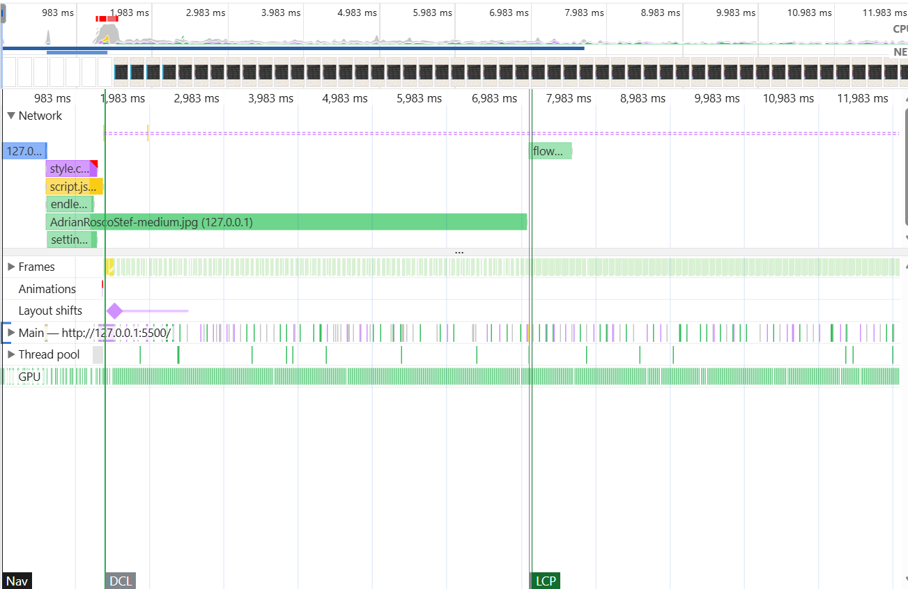
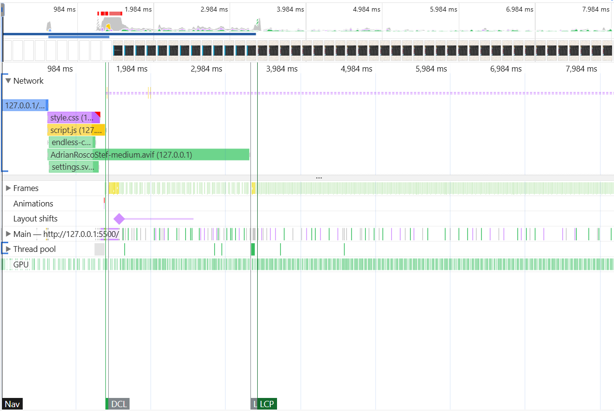

# Notes

## Render speed

Page loading was sped up significantly by switching from JPG to AVIF for the innerImage:

Notice that LCP goes from about 7 seconds to about 3.2 seconds (tested with 4x cpu slowdown, slow 4g on edge).

